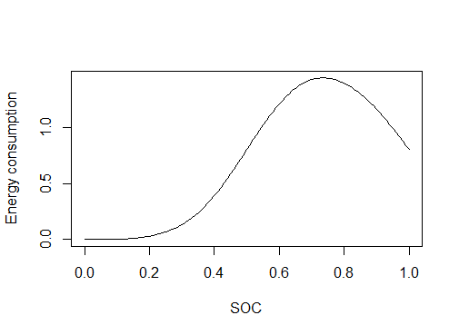

## Variable

| Term | description                            |
| ---- | -------------------------------------- |
| C    | consumer who own e-car                 |
| T    | electronic capacitor for an e-car      |
| x    | SOC: the electricity that already used |
| t    | time(0~24)                             |
| E    | energy consumption                     |

## Model

For the free charing devices in the market, we choose to include “charging pole for E-car” and “plugs for charing phone” in our analyzing.

### Model for Charing Pole

**model 1: the distribution for initial  SOC:**

$f_{\mathrm{c}}(x)=\frac{1}{\sqrt{2 \pi} \times 0.1772} \mathrm{e}^{-\frac{(x-0.5137)^{2}}{2 \times 0.1772^{2}}}$

**model 2: the distribution for charing demand probability**

$p_{\mathrm{c}-\mathrm{shop}}(x)=0.01272 \mathrm{e}^{2.474 x}+1.528 \times 10^{-5} \mathrm{e}^{10.95 x}$

**model 3: the distribution for  consumer popular time**

*Assume it adapt the normal distribution, then:*

$C(t,\mu,\sigma)=\frac{1}{\sigma \sqrt{2 \pi}} e^{-\frac{(t-\mu)^{2}}{2 \sigma^{2}}}$

for the variable $\mu$ and $\sigma$, it depend on each shop’s real situation, which can be easily calculated. Later, we will show a DEMO.

**model 4: the energy demand function:**

For: P(the SOC for car owner is x) $\cup$ P(the E-car owner want to charge), we can briefly describe as:

$f_c(x)\times p_{x-shop}(x)$

and for the number of people , it is:

$f_c(x)\times p_{x-shop}(x)\times C$

then, for the energy consumption for a singer car, it can be describe as:

$E_{total} = T\times X$

Finally, considering the time distribution which shows in *model 3* and for the e-car owner with different SOC, we can build the *energy consumption model by*: 

$E = \sum_{t=0}^{24}{\int_{0}^1{f_c(x)\times p_{x-shop}(x)\times C(t)\times X\times T}}$

or it can also be write as:

$E = \sum_{t=0}^{24}{\int_{0}^1{\frac{1}{\sqrt{2 \pi} \times 0.1772} \mathrm{e}^{-\frac{(x-0.5137)^{2}}{2 \times 0.1772^{2}}}\times (0.01272 \mathrm{e}^{2.474 x}+1.528 \times 10^{-5} \mathrm{e}^{10.95 x})\times \frac{1}{\sigma \sqrt{2 \pi}} e^{-\frac{(t-\mu)^{2}}{2 \sigma^{2}}}\times X\times T}}$

however, to simplify as model solving procedural, we can consider the *consumer popular time* as a single variable. That is, we turn $C(t)$ to a constant *P* which describe the total consumers in a shop in a single day. Subsequently, we can rewrite our model like:

$E = \int_{0}^1{\frac{1}{\sqrt{2 \pi} \times 0.1772} \mathrm{e}^{-\frac{(x-0.5137)^{2}}{2 \times 0.1772^{2}}}\times (0.01272 \mathrm{e}^{2.474 x}+1.528 \times 10^{-5} \mathrm{e}^{10.95 x})\times x\times T}$

For the Soc VS probability of charging graph, is showing below:

### Model for plugs 

from Daniel T. Wagner’s research in “device analyze” from 4000 participant, it conclude that it is common for people to charge their phone for 1 hour when they do outside since it can already solve their problem. Also, the poll conduct by *LG* also shows that when people have demand in charing their phone, the probability   for each way they choose to solve their problem can be shown by the form below:

| solution                                   | probability |
| ------------------------------------------ | ----------- |
| ask for stranger for help                  | 39%         |
| **do nothing but arguing**                 | 23%         |
| **ordering something at a bar and charge** | 22%         |
| skip the gym to charge their phone         | 33%         |
| secretly “borrowing” else’ s charger       | 35%         |

In our research, we do the research on a coffee shop, according to the form, we can easily conduct that the Pcharge in cofe=22%. However. Also, considering coffee shop supply charger. Hence the people used to *do nothing but arguing* will also choose to charge their phone in shop. Finally, the probability for a people who have demand to charge phone to charge in coffee bar is equal to:

Pcharge in bar=Pdo nothing but arguing+P{order something at bar and charge = 23% + 22% = 45%

Also, according to the research by LG, when the phone’s power is less than 20%, people will began to show the wonder of charging. Therefore, the probability that a consumer in a shop need to charge his/her phone is:

Pcharge phone = Ppower less than 20% $$ Pcharge in bar

To discover the Ppower less than 20%, we find a series of data which record charging information.

